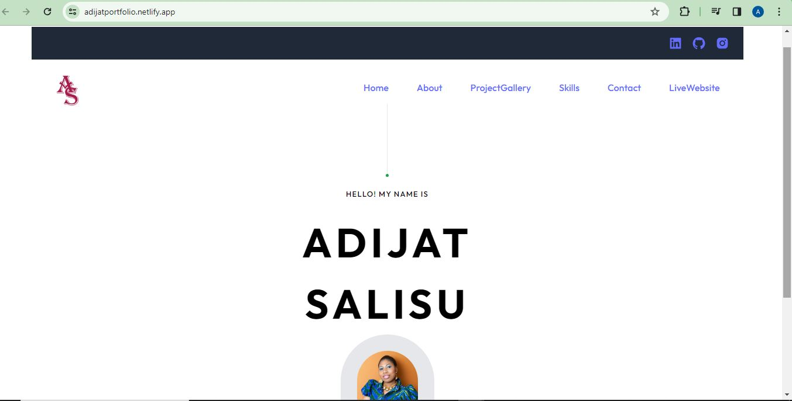

# Cities-Weather-Dashboard

<!-- Developer Signature and github details -->
 

  
  

## Deployed page URL
[My React Portfolio App](https://adijatportfolio.netlify.app/)

## Description
This is a personal tech portfolio created using React .

## Table of Contents
- [Installation](#installation)
- [Usage](#usage)
- [License](#license)
- [Contribution](#contribution)
- [Tests](#tests)
- [Questions](#questions)

<!-- Add installation instructions here -->
## Installation 
HTTPS: git clone https://github.com/addy306/React-Portfolio.git

SSH: git clone git@github.com:addy306/React-Portfolio.git

<!-- Add usage information here -->
## Usage 
Simply click on deployed url 

## Webpage Features
### Screenshots, Videos, GIF

### Screenshot of App Desktop View

### GIF of App been used

### GIF of App responsivness

## License
This project is licensed under the MIT License - see the [LICENSE](LICENSE) file for details.

<!-- Add contributing guidelines here -->
## Contributing
Feel free to contribute to make it better.

<!-- Add information about how to run tests here -->
## Tests 
Test in browser

## Built With
* Boostrap
* Reactjs
* Navigation with React Router

## Questions
If you have any questions, feel free to contact me:
- GitHub: [addy306](https://github.com/addy306)
- Email: adijatworkdoc@gmail.com

